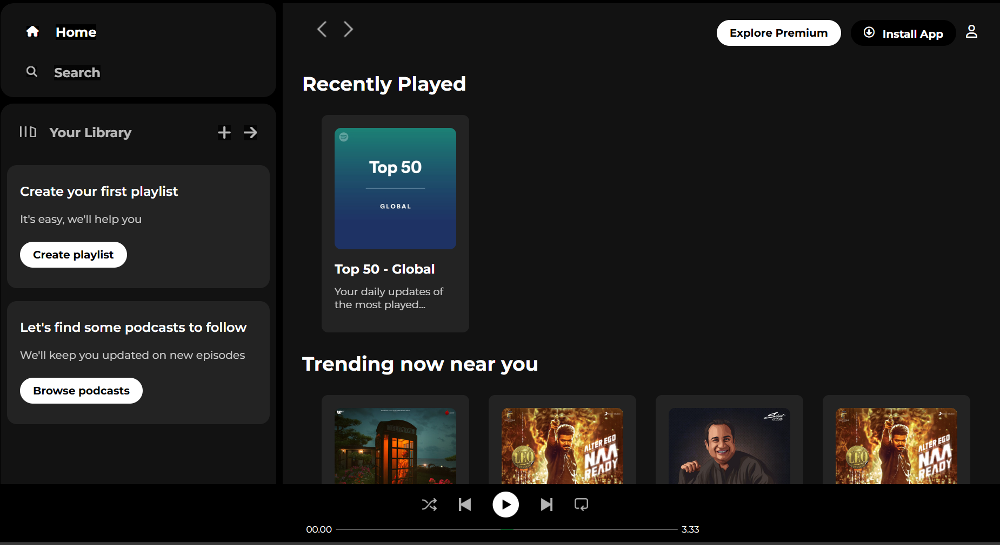

# 🎵 Spotify Clone (HTML + CSS)

This is a simple **Spotify web clone** created using **HTML** and **CSS** only. It replicates the look and feel of Spotify's user interface and serves as a front-end UI practice project. No JavaScript or backend functionality is included.



## 🚀 Features

- 🎧 Clean and structured layout
- 📱 Fully responsive and mobile-friendly (basic responsiveness)
- 🎨 Styled entirely using CSS
- 🖼️ Music cards with album artwork
- 🧭 Navigation bar and footer design
- 🎵 Music control UI layout

## 📚 Topics Covered / Used in the Code

- ✅ Basic HTML structure (doctype, html, head, body)
- ✅ CSS Flexbox for layout alignment and spacing
- ✅ HTML elements: `div`, `img`, `nav`, `footer`, etc.
- ✅ Custom CSS classes for styling components
- ✅ Use of external images and icon assets
- ✅ Styling with `position`, `z-index`, `margin`, `padding`, `gap`, etc.
- ✅ Fonts, colors, backgrounds, and hover effects
- ✅ Responsive UI design principles (basic level)

## 📁 File Structure

```
Spotify/
├── index.html              # Main HTML file
├── style.css               # Styling file
└── assets/                 # Folder containing all images and icons
    ├── logo.png
    ├── card1img.jpeg
    ├── card2img.jpeg
    ├── card3img.jpeg
    ├── card4img.jpeg
    ├── card5img.jpeg
    ├── card6img.jpeg
    ├── forward_icon.png
    ├── backward_icon.png
    ├── player_icon1.png
    ├── player_icon2.png
    ├── player_icon3.png
    ├── player_icon4.png
    ├── player_icon5.png
    ├── play_musicbar.png
    └── library_icon.png
```

## 📦 Technologies Used

- HTML5
- CSS3 (Flexbox, custom styling)


## 📝 Notes

- This is a **static front-end clone**, and no audio/music will play.
- Created for UI/UX practice and to enhance CSS layout skills.
- Great for beginner-level front-end developers to understand layout structuring.


